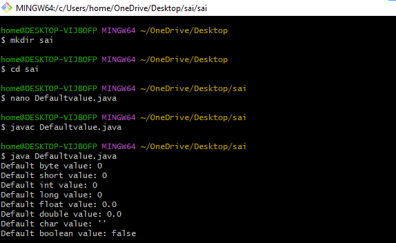

# EXPERIMENT-1
## 1A>DISPLAY DEFAULT VALUES OF PRIMITIVE DATA TYPES IN JAVA
SOURCE CODE:
``` java
class DefaultValues {
    byte b;
    short s;
    int i;
    long l;
    float f;
    double d;
    char c;
    boolean bool;

        public static void main(String[] args) {
        DefaultValues obj = new DefaultValues();
        System.out.println("Default byte value: " + obj.b);
        System.out.println("Default short value: " + obj.s);
        System.out.println("Default int value: " + obj.i);
        System.out.println("Default long value: " + obj.l);
        System.out.println("Default float value: " + obj.f);
        System.out.println("Default double value: " + obj.d);
        System.out.println("Default char value: '" + obj.c + "'");
        System.out.println("Default boolean value: " + obj.bool);
    }
}
```
## OUTPUT:



## 1B>Program to find roots of a quadratic equation
SOURCE CODE:
``` java
import java.util.Scanner;

class QuadraticRoots {
    public static void main(String[] args) {
        Scanner sc = new Scanner(System.in);

        System.out.print("Enter coefficient a: ");
        double a = sc.nextDouble();

        System.out.print("Enter coefficient b: ");
        double b = sc.nextDouble();

        System.out.print("Enter coefficient c: ");
        double c = sc.nextDouble();

        double D = b * b - 4 * a * c;

        System.out.println("Discriminant = " + D);

        if (D > 0) {
            double x1 = (-b + Math.sqrt(D)) / (2 * a);
            double x2 = (-b - Math.sqrt(D)) / (2 * a);
            System.out.println("Roots are real and distinct");
            System.out.println("Root 1 = " + x1);
            System.out.println("Root 2 = " + x2);
        } 
        else if (D == 0) {
            double x = -b / (2 * a);
            System.out.println("Roots are real and equal");
            System.out.println("Root = " + x);
        } 
        else {
            double real = -b / (2 * a);
            double imag = Math.sqrt(-D) / (2 * a);
            System.out.println("Roots are imaginary");
            System.out.println("Root 1 = " + real + " + " + imag + "i");
            System.out.println("Root 2 = " + real + " - " + imag + "i");
        }

        sc.close();
    }
}
```
## output:


