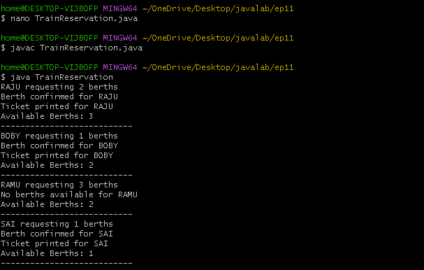

11>Write a Program using Threads for the following case study: Train Reservation system To reserve a berth the following process need to be followed, at first check the number of available berths with the requested berths, if the number of requested berths are less than or equal to available berths then allot berth and print ticket or else display no berths are available. Assume that N persons are trying to reserve the berth, display their sequence of reservation status
along with the number of available berths. Note : The person can print ticket only if berth is confirmed

```
class Reservation {
    int availableBerths;

    Reservation(int berths) {
        availableBerths = berths;
    }

    synchronized void reserve(String name, int requestedBerths) {
        System.out.println(name + " requesting " + requestedBerths + " berths");

        if (requestedBerths <= availableBerths) {
            System.out.println("Berth confirmed for " + name);
            availableBerths = availableBerths - requestedBerths;
            System.out.println("Ticket printed for " + name);
        } else {
            System.out.println("No berths available for " + name);
        }

        System.out.println("Available Berths: " + availableBerths);
        System.out.println("---------------------------");
    }
}

class Person extends Thread {
    Reservation reservation;
    int berths;

    Person(Reservation reservation, String name, int berths) {
        super(name);
        this.reservation = reservation;
        this.berths = berths;
    }

    public void run() {
        reservation.reserve(getName(), berths);
    }
}

public class TrainReservation {
    public static void main(String[] args) {

        Reservation r = new Reservation(5);

        Person p1 = new Person(r, "RAJU", 2);
        Person p2 = new Person(r, "SAI", 1);
        Person p3 = new Person(r, "RAMU", 3);
        Person p4 = new Person(r, "BOBY", 1);

        p1.start();
        p2.start();
        p3.start();
        p4.start();
    }
}


```
## OUTPUT:


