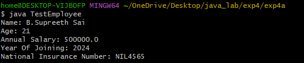
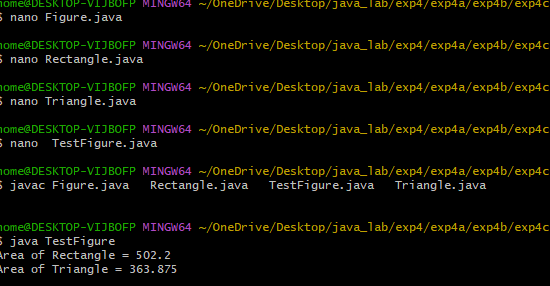

4a)SINGLE INHERTENCE
```java
public class Person
 {
 String name; int age;

    
    Person(String name, int age) {
        this.name = name;
        this.age = age;
    }

    
    void displayPersonDetails() {
        System.out.println("Name: " + name);
        System.out.println("Age: " + age);
    }
}


public class Employee extends Person {
    double annualSalary;
    int yearOfJoining;
    String nationalInsuranceNumber;

    
    Employee(String name, int age, double annualSalary,
             int yearOfJoining, String nationalInsuranceNumber) {

        super(name, age); // Call Person constructor
        this.annualSalary = annualSalary;
        this.yearOfJoining = yearOfJoining;
        this.nationalInsuranceNumber = nationalInsuranceNumber;
    }

    
    void displayEmployeeDetails() {
        displayPersonDetails();
        System.out.println("Annual Salary: " + annualSalary);
        System.out.println("Year Of Joining: " + yearOfJoining);
        System.out.println("National Insurance Number: " + nationalInsuranceNumber);
    }
}


public class TestEmployee {
    public static void main(String[] args) {

        Employee emp1 = new Employee(
        "B.Supreeth Sai",
            21,
            500000.0,
             2024,
           "NIL4565"
        );

        emp1.displayEmployeeDetails();
    }
}
```

##output



4b)
```java
public class Bicycle {
    String pedalType;

    void showBicycleInfo() {
        System.out.println("This is a bicycle with pedals.");
         System.out.println("Pedal Type: " + pedalType);

    }
}

class Motorbike extends Bicycle {
    int engineCapacity;

    void showMotorbikeInfo() {
        System.out.println("This motorbike has an engine.");
        System.out.println("Engine Capacity: " + engineCapacity + " cc");
    }
}

public class ElectricBike extends Motorbike {
    int batteryCapacity;

    void showElectricBikeInfo() {
        System.out.println("This electric bike has an electric motor and battery.") ;
     System.out.println("Battery Capacity: " + batteryCapacity + " Wh");

    }
}
public class TestVehicle {
    public static void main(String[] args) {        
        ElectricBike eBike = new ElectricBike();
        eBike.pedalType = "Flat";
        eBike.engineCapacity = 120;
        eBike.batteryCapacity = 400;

        
        eBike.showBicycleInfo();     
        eBike.showMotorbikeInfo();    
        eBike.showElectricBikeInfo();
    }
}
```

##output


4c)
```java
public abstract class Figure {
    double dim1;
    double dim2;
   public Figure(double dim1, double dim2) {
        this.dim1 = dim1;
        this.dim2 = dim2;
    }
    public abstract double area();
}
public class Rectangle extends Figure {
   public Rectangle(double length, double breadth) {
        super(length, breadth);
    }
    public double area() {
        return dim1 * dim2;
    }
}
public class Triangle extends Figure {    
    public Triangle(double base, double height) {
        super(base, height);
    }
    public double area() {
        return 0.5 * dim1 * dim2;
    }
}
public class TestFigure {
    public static void main(String[] args) {
              Figure f1 = new Rectangle(40.5, 12.4); 
        System.out.println("Area of Rectangle = " + f1.area());
              Figure f2 = new Triangle(20.5, 35.5); 
        System.out.println("Area of Triangle = " + f2.area());
    }
}
```
##output


