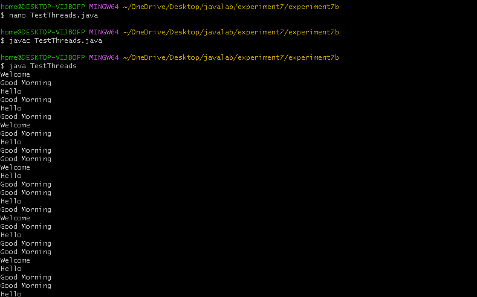
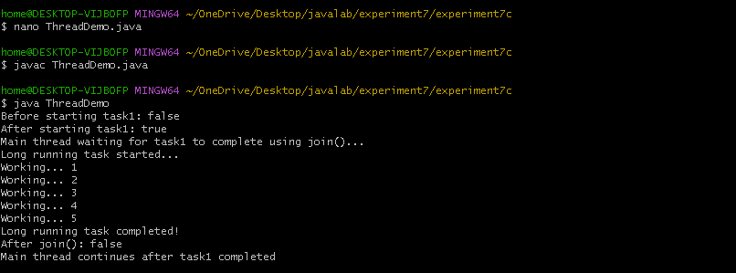

EXPERIMENT7
7A>A JAVA PROGRAM FOR CREATION OF USER DEFINED EXCEPTION
```
CODE:
import java.util.Scanner;
class InvalidCountryException extends Exception {
    InvalidCountryException() {
        super();
    }

    InvalidCountryException(String message) {
        super(message);
    }
}
class UserRegistration {
    void registerUser(String username, String userCountry)
            throws InvalidCountryException {

        if (!userCountry.equalsIgnoreCase("India")) {
            throw new InvalidCountryException(
                "User outside India cannot be registered."
            );
        } else {
            System.out.println("User registered successfully.");
        }
    }
}

public class  UserRegion {
    public static void main(String[] args) {
        Scanner sc = new Scanner(System.in);
        try {
            System.out.print("Enter the user name: ");
            String uname = sc.nextLine();
            System.out.print("Enter the country name: ");
            String ucountry = sc.nextLine();
            UserRegistration ur = new UserRegistration();
            ur.registerUser(uname, ucountry);
        }
        catch (InvalidCountryException e) {
            System.out.println(e.getMessage());
        }
        catch (Exception e) {
            System.out.println("Unknown error: " + e);
        }
        finally {
            sc.close();
            System.out.println("Finally block executed successfully.");
            System.out.println("Program terminated properly.");
        }
```
##output


7B>JAVA PROGRAM THAT CREATES THREADS BY EXTENDING THREADCLASS.


```
CODE:
class GoodMorningThread extends Thread {
    public void run() {
        try {
            while(true) {
                System.out.println("Good Morning");
                Thread.sleep(1000);
            }
        }
        catch(InterruptedException e) {
            System.out.println(e);
        }
    }
}

class HelloThread extends Thread {
    public void run() {
        try{
            while(true) {
                System.out.println("Hello");
                Thread.sleep(2000);
            }
        }
        catch(InterruptedException e) {
            System.out.println(e);
        }
    }
}

class WelcomeThread extends Thread {
    public void run() {
        try {
            while(true) {
                System.out.println("Welcome");
                Thread.sleep(3000);
            }
        }
        catch(InterruptedException e) {
            System.out.println(e);
        }
    }
}


public class TestThreads {
    public static void main(String[] args) {
        GoodMorningThread t1 = new GoodMorningThread();
        HelloThread t2 = new HelloThread();
        WelcomeThread t3 = new WelcomeThread();
        t1.start();
        t2.start();
        t3.start();
    }
}

```

##output



7C> PROGRAM FOR ILLUSTRATING IS ALIVE AND JOIN () IN JAVA
```
CODE:
class LongRunningTask extends Thread {
    public void run() {
        try {
            System.out.println("Long running task started...");
            for(int i = 1; i <= 5; i++)
            {
                System.out.println("Working... " + i);
                Thread.sleep(1000);
            }
            System.out.println("Long running task completed!");
        }
        catch(InterruptedException e){
            System.out.println(e);
        }
    }
}
public class ThreadDemo {
    public static void main(String[] args) {
        LongRunningTask task1 = new LongRunningTask();
        System.out.println("Before starting task1: " + task1.isAlive());
        task1.start();
        System.out.println("After starting task1: " + task1.isAlive());
        try  {
            System.out.println("Main thread waiting for task1 to complete using join()...");
            task1.join();
        }
        catch(InterruptedException e)  {
            System.out.println(e);
        }
        System.out.println("After join(): " + task1.isAlive());
        System.out.println("Main thread continues after task1 completed");
    }
}


```

##output

