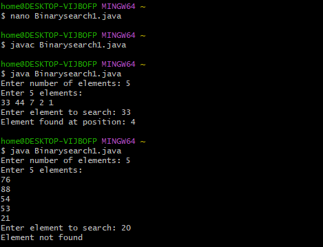
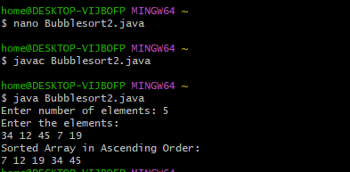
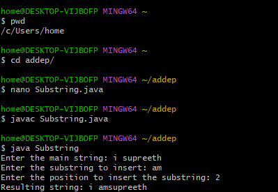
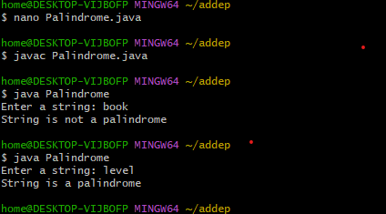
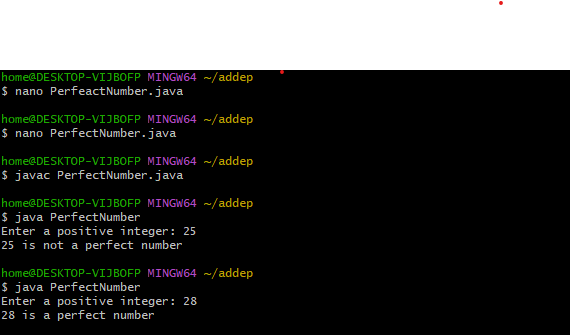
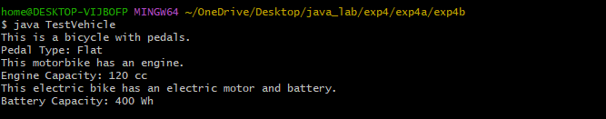

# JAVALAB-CSE-F
EXPERIMENT-1
```java
1A>DISPLAY DEFAULT VALUES OF PRIMITIVE DATA TYPES IN JAVA
CODE:
class DefaultValues {
    byte b;
    short s;
    int i;
    long l;
    float f;
    double d;
    char c;
    boolean bool;
        public static void main(String[] args) {
        DefaultValues obj = new DefaultValues();
        System.out.println("Default byte value: " + obj.b);
        System.out.println("Default short value: " + obj.s);
        System.out.println("Default int value: " + obj.i);
        System.out.println("Default long value: " + obj.l);
        System.out.println("Default float value: " + obj.f);
        System.out.println("Default double value: " + obj.d);
        System.out.println("Default char value: '" + obj.c + "'");
        System.out.println("Default boolean value: " + obj.bool);
    }
}

```


##output


``` java
1B>PROGRAM TO FIND ROOTS OF A QUADRATIC EQUATION
CODE:
import java.util.Scanner;

class QuadraticRoots {
    public static void main(String[] args) {
        Scanner sc = new Scanner(System.in);

        System.out.print("Enter coefficient a: ");
        double a = sc.nextDouble();

        System.out.print("Enter coefficient b: ");
        double b = sc.nextDouble();

        System.out.print("Enter coefficient c: ");
        double c = sc.nextDouble();

        double D = b * b - 4 * a * c;

        System.out.println("Discriminant = " + D);

        if (D > 0) {
            double x1 = (-b + Math.sqrt(D)) / (2 * a);
            double x2 = (-b - Math.sqrt(D)) / (2 * a);
            System.out.println("Roots are real and distinct");
            System.out.println("Root 1 = " + x1);
            System.out.println("Root 2 = " + x2);
        } 
        else if (D == 0) {
            double x = -b / (2 * a);
            System.out.println("Roots are real and equal");
            System.out.println("Root = " + x);
        } 
        else {
            double real = -b / (2 * a);
            double imag = Math.sqrt(-D) / (2 * a);
            System.out.println("Roots are imaginary");
            System.out.println("Root 1 = " + real + " + " + imag + "i");
            System.out.println("Root 2 = " + real + " - " + imag + "i");
        }

        sc.close();
    }
}


```
##output


EXPERIMENT 2
```java
2A)IMPLEMENT CLASS MECHANISM IN JAVA. CREATE A CLASS, METHODS AND INVOKE 
THEM INSIDE MAIN METHOD.
CODE:
class MyClass {
   void displayMessage() {
        System.out.println("Hello! I am supreeth.");
    }
    int add(int a, int b) {
        return a + b;
    }
}
public class Mainclass {
    public static void main(String[] args) {
MyClass obj = new MyClass();
        obj.displayMessage();
        int result = obj.add(15, 30);
        System.out.println("Addition Result: " + result);
    }
}
```
##output


```java
2B) PROGRAM IMPLEMENT METHOD OVERLOADING.
CODE:
class Overload{

    int add(int a, int b) {
        return a + b;
    }
    double add(double a, double b) {
        return a + b;
    }


    int add(int a, int b, int c) {
        return a + b + c;
    }

    public static void main(String[] args) {
        Overload obj = new Overload();

        int result1 = obj.add(15, 50);
        double result2 = obj.add(10.5, 40.5);
        int result3 = obj.add(25,45,60);

        System.out.println("result of adding two integers: " + result1);
        System.out.println("result of adding two doubles values : " + result2);
        System.out.println("result of adding three integers: " + result3);
    }
}


```

##output


```java
2C)PROGRAM TO IMPLEMENT CONSTRUCTOR.
CODE:
class Student {
    String name;
    int age;
    int marks;

    Student(String n, int a, int m) {
        name = n;
        age = a;
        marks = m;
    }


    void display() {
        System.out.println("Name  : " + name);
        System.out.println("Age   : " + age);
        System.out.println("Marks : " + marks);
    }


    public static void main(String[] args) {
        Student s = new Student("Supreeth", 19, 85);
        s.display();
    }
}

```
##output


ADDITIONAL EXPERIMENT-2

2) TO WRITE A JAVA PROGRAM TO FIND THE SUM OF THE FIRST N FIBONACCI NUMBERS.
```JAVA
CODE:
import java.util.Scanner;

class Fibonacci {

    int n;
    int firstNumber;
    int secondNumber;
    int thirdNumber;
    int sum;

    // Constructor
    Fibonacci(int number) {
        n = number;
        firstNumber = 0;
        secondNumber = 1;
        thirdNumber = 0;
        sum = 0;
    }

    // Method to generate Fibonacci series and sum
    void generate() {
        System.out.print("Fibonacci Series: ");

        int count = n; // to preserve original n

        while (n > 0) {
            sum += firstNumber;

            if (n == 1) {
                System.out.print(firstNumber + ".");
            } else {
                System.out.print(firstNumber + ", ");
            }

            thirdNumber = firstNumber + secondNumber;
            firstNumber = secondNumber;
            secondNumber = thirdNumber;

            n--;
        }

        System.out.println("\nSum of Fibonacci series: " + sum);
    }

    // Main method
    public static void main(String[] args) {
        Scanner sc = new Scanner(System.in);

        System.out.print("Enter the value of n: ");
        int number = sc.nextInt();

        Fibonacci f = new Fibonacci(number);
        f.generate();
    }
}


```
##output


EXPERIMENT-3


3A) IMPLEMENT CONSTRUCTOR OVERLOADING IN JAVA.
```java
CODE:class Student {

    // Instance variables
    String name;
    int age;
    int marks;

    // Default constructor
    Student() {
        name = "Not Assigned";
        age = 0;
        marks = 0;
    }

    // Parameterized constructor (2 parameters)
    Student(String name, int age) {
        this.name = name;
        this.age = age;
        this.marks = 0;
    }

    // Parameterized constructor (3 parameters)
    Student(String name, int age, int marks) {
        this.name = name;
        this.age = age;
        this.marks = marks;
    }

    // Method to display values
    void display() {
        System.out.println("Name  : " + name);
        System.out.println("Age   : " + age);
        System.out.println("Marks : " + marks);
        System.out.println("-------------------");
    }

    // Main method
    public static void main(String[] args) {

        // Object using default constructor
        Student s1 = new Student();

        // Object using 2-parameter constructor
        Student s2 = new Student("sai",19,95);

        // Object using 3-parameter constructor
        Student s3 = new Student("Ramu", 20, 80);

        // Display details
        s1.display();
        s2.display();
        s3.display();
    }
}
```

##output


3b) WRITE A JAVA PROGRAM TO SEARCH FOR AN ELEMENT IN A GIVEN LIST OF ELE-
MENTS USING BINARY
search mechanism.
``` java

CODE:
import java.util.Scanner;
import java.util.Arrays;

class BinarySearch {
    public static void main(String[] args) {

        Scanner sc = new Scanner(System.in);

        // Input number of elements
        System.out.print("Enter number of elements: ");
        int n = sc.nextInt();

        int[] arr = new int[n];

        // Input array elements
        System.out.println("Enter " + n + " elements:");
        for (int i = 0; i < n; i++) {
            arr[i] = sc.nextInt();
        }

        // Sort the array
        Arrays.sort(arr);

        // Input key element
        System.out.print("Enter element to search: ");
        int key = sc.nextInt();

        int low = 0, high = n - 1;
        boolean found = false;

        // Binary Search logic
        while (low <= high) {
            int mid = (low + high) / 2;

            if (arr[mid] == key) {
                System.out.println("Element found at position: " + (mid + 1));
                found = true;
                break;
            } else if (arr[mid] < key) {
                low = mid + 1;
            } else {
                high = mid - 1;
            }
        }

        // If not found
        if (!found) {
            System.out.println("Element not found");
        }

        sc.close();
    }
}


```


##output



3C) DEVELOP A JAVA PROGRAM TO SORT FOR AN ELEMENT IN A GIVEN LIST OF ELE-
MENTS USING BUBBLE SORT.
```java

CODE:

import java.util.Scanner;

class BubbleSort {
    public static void main(String[] args) {

        Scanner sc = new Scanner(System.in);

        // Input number of elements
        System.out.print("Enter number of elements: ");
        int n = sc.nextInt();

        int[] arr = new int[n];

        // Input elements
        System.out.println("Enter the elements:");
        for (int i = 0; i < n; i++) {
            arr[i] = sc.nextInt();
        }

        // Bubble Sort logic
        for (int i = 0; i < n - 1; i++) {
            for (int j = 0; j < n - i - 1; j++) {
                if (arr[j] > arr[j + 1]) {
                    // Swap
                    int temp = arr[j];
                    arr[j] = arr[j + 1];
                    arr[j + 1] = temp;
                }
            }
        }

        // Display sorted array
        System.out.println("Sorted Array in Ascending Order:");
        for (int i = 0; i < n; i++) {
            System.out.print(arr[i] + " ");
        }

        sc.close();
    }
}

```

##output



ADDITIONAL EXPERIMENT
```JAVA
1)JAVA PROGRAM TO INSERT A SUB STRING INTO A GIVEN MAIN STRING FROM A
GIVEN POSITION.

CODE:

import java.util.Scanner;

public class Substring {
    public static void main(String[] args) {
        Scanner sc = new Scanner(System.in);

        System.out.print("Enter the main string: ");
        String mainString = sc.nextLine();

        System.out.print("Enter the substring to insert: ");
        String subString = sc.nextLine();

        System.out.print("Enter the position to insert the substring: ");
        int position = sc.nextInt();

        if (position < 0 || position > mainString.length()) {
            System.out.println("Invalid position!");
        }
else
 {
            String firstPart = mainString.substring(0, position);
            String secondPart = mainString.substring(position);

            String resultString = firstPart + subString + secondPart;
            System.out.println("Resulting string: " + resultString);
        }

        sc.close();
    }
}


```
##output



3)JAVA PROGRAM TO DETERMINE IF A GIVEN STRING IS PALINDROME OR NOT.
``` JAVA
CODE:
import java.util.Scanner;

public class Palindrome {
    public static void main(String[] args) {
        Scanner sc = new Scanner(System.in);

        System.out.print("Enter a string: ");
        String str = sc.nextLine();

        int start = 0;
        int end = str.length() - 1;

        boolean isPalindrome = true;

        while (start < end) {
            if (str.charAt(start) != str.charAt(end)) {
                isPalindrome = false;
                break;
            }
            start++;
            end--;
        }

        if (isPalindrome) {
            System.out.println("String is a palindrome");
        } else {
            System.out.println("String is not a palindrome");
        }

        sc.close();
    }
}
```
##output



4)JAVA PROGRAM TO CHECK IF A NUMBER IS A PERFECT NUMBER.
```java
CODE:
import java.util.Scanner;

public class PerfectNumber {
    public static void main(String[] args) {
        Scanner sc = new Scanner(System.in);

        System.out.print("Enter a positive integer: ");
        int num = sc.nextInt();

        int sum = 0;

        for (int i = 1; i <= num - 1; i++) {
            if (num % i == 0) {
                sum = sum + i;
            }
        }

        if (sum == num) {
            System.out.println(num + " is a perfect number");
        } else {
            System.out.println(num + " is not a perfect number");
        }

        sc.close();
    }
}
```
##output



4a.SINGLE INHERTENCE
```JAVA


public class Person
 {
 String name; int age;

    
    Person(String name, int age) {
        this.name = name;
        this.age = age;
    }

    // Method to display person details
    void displayPersonDetails() {
        System.out.println("Name: " + name);
        System.out.println("Age: " + age);
    }
}


public class Employee extends Person {
    double annualSalary;
    int yearOfJoining;
    String nationalInsuranceNumber;

    
    Employee(String name, int age, double annualSalary,
             int yearOfJoining, String nationalInsuranceNumber) {

        super(name, age); // Call Person constructor
        this.annualSalary = annualSalary;
        this.yearOfJoining = yearOfJoining;
        this.nationalInsuranceNumber = nationalInsuranceNumber;
    }

    
    void displayEmployeeDetails() {
        displayPersonDetails();
        System.out.println("Annual Salary: " + annualSalary);
        System.out.println("Year Of Joining: " + yearOfJoining);
        System.out.println("National Insurance Number: " + nationalInsuranceNumber);
    }
}


public class TestEmployee {
    public static void main(String[] args) {

        Employee emp1 = new Employee(
        "B.Supreeth Sai",
            21,
            500000.0,
             2024,
           "NIL4565"
        );

        emp1.displayEmployeeDetails();
    }
}
```
##output


4B.MULTIPLE INHERITENCE
```JAVA


public class Bicycle {
    String pedalType;

    void showBicycleInfo() {
        System.out.println("This is a bicycle with pedals.");
         System.out.println("Pedal Type: " + pedalType);

    }
}

class Motorbike extends Bicycle {
    int engineCapacity;

    void showMotorbikeInfo() {
        System.out.println("This motorbike has an engine.");
        System.out.println("Engine Capacity: " + engineCapacity + " cc");
    }
}

public class ElectricBike extends Motorbike {
    int batteryCapacity;

    void showElectricBikeInfo() {
        System.out.println("This electric bike has an electric motor and battery.") ;
     System.out.println("Battery Capacity: " + batteryCapacity + " Wh");

    }
}
public class TestVehicle {
    public static void main(String[] args) {        
        ElectricBike eBike = new ElectricBike();
        eBike.pedalType = "Flat";
        eBike.engineCapacity = 120;
        eBike.batteryCapacity = 400;

        
        eBike.showBicycleInfo();     
        eBike.showMotorbikeInfo();    
        eBike.showElectricBikeInfo();
    }
}

```
##output



4C.ABSTRACRT CLASS
```JAVA
public abstract class Figure {
    double dim1;
    double dim2;
   public Figure(double dim1, double dim2) {
        this.dim1 = dim1;
        this.dim2 = dim2;
    }
    public abstract double area();
}
public class Rectangle extends Figure {
   public Rectangle(double length, double breadth) {
        super(length, breadth);
    }
    public double area() {
        return dim1 * dim2;
    }
}
public class Triangle extends Figure {    
    public Triangle(double base, double height) {
        super(base, height);
    }
    public double area() {
        return 0.5 * dim1 * dim2;
    }
}
public class TestFigure {
    public static void main(String[] args) {
              Figure f1 = new Rectangle(40.5, 12.4); 
        System.out.println("Area of Rectangle = " + f1.area());
              Figure f2 = new Triangle(20.5, 35.5); 
        System.out.println("Area of Triangle = " + f2.area());
    }
}

```
##output


EXPERIMENT-5


5a>JAVA program to implement Interface
```java
interface Sortable {
    void sort(int[] arr);
}


class BubbleSort implements Sortable {
    public void sort(int[] arr) {
        int n = arr.length;
        for (int i = 0; i < n - 1; i++) {
            for (int j = 0; j < n - i - 1; j++) {
                if (arr[j] > arr[j + 1]) {
                    // swap
                    int temp = arr[j];
                    arr[j] = arr[j + 1];
                    arr[j + 1] = temp;
                }
            }
        }
    }
}


class SelectionSort implements Sortable {
    public void sort(int[] arr) {
        int n = arr.length;
        for (int i = 0; i < n - 1; i++) {
            int minIndex = i;
            for (int j = i + 1; j < n; j++) {
                if (arr[j] < arr[minIndex]) {
                    minIndex = j;
                }
            }
            // swap
            int temp = arr[i];
            arr[i] = arr[minIndex];
            arr[minIndex] = temp;
        }
    }
}


public class Testsort {
    static void printArray(int[] arr) {
        for (int num : arr) {
            System.out.print(num + " ");
        }
        System.out.println();
    }

    public static void main(String[] args) {
        int[] arr1 = {7,9,8,4,5};
        Sortable ref;

        ref = new BubbleSort();
        ref.sort(arr1);
        System.out.println("Array sorted using BubbleSort:");
        printArray(arr1);

        int[] arr2 = {6,2,3,1,0};
        ref = new SelectionSort();
        ref.sort(arr2);
        System.out.println("Array sorted using SelectionSort:");
        printArray(arr2);
    }
}
```


##output


5b>JAVA program that implements Runtime polymorphism
```java

class Vehicle {
    void run() {
        System.out.println("Vehicle is running");
    }
}


class Car extends Vehicle {
    
    void run() {
        System.out.println("Car is running on four wheels");
    }
}


class Bike extends Vehicle {
   
    void run() {
        System.out.println("Bike is running on two wheels");
    }
}

public class TestVehicle {
    public static void main(String[] args) {
        Vehicle v;        
        v = new Car();
        v.run();      

        v = new Bike();
        v.run(); 
      
        v = new Vehicle();
        v.run(); 
    }
}

```

##output

5c>JAVA program using StringBuffer to delete, remove character.
```java
 public class StringBufferDeleteDemo {
    public static void main(String[] args) {

       
        StringBuffer sb = new StringBuffer("Java Programming");

       
        System.out.println("Original String: " + sb);

      
        sb.deleteCharAt(4);
        System.out.println("After deleting character at index 4: " + sb);

       
        sb.delete(0, 4);
        System.out.println("After deleting characters from index 0 to 4: " + sb);
    }
}
```

##output

