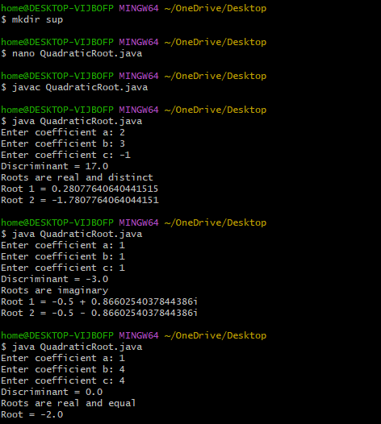
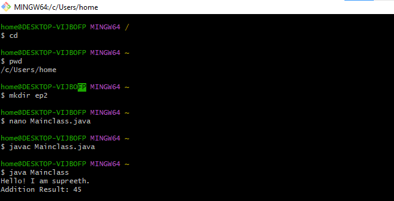
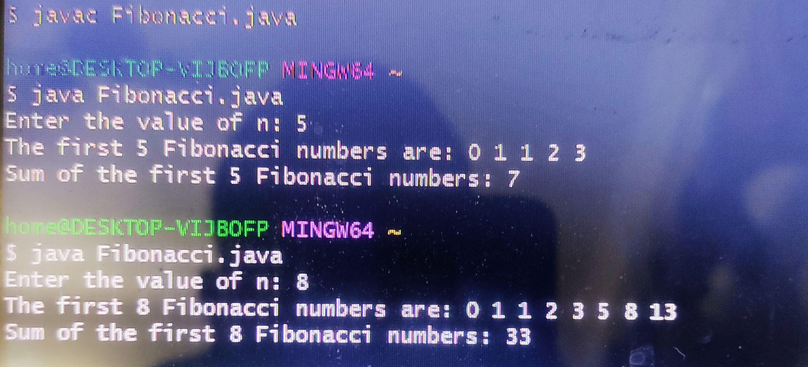

# JAVALAB-CSE-F
EXPERIMENT-1
```java
1A>DISPLAY DEFAULT VALUES OF PRIMITIVE DATA TYPES IN JAVA
CODE:
class DefaultValues {
    byte b;
    short s;
    int i;
    long l;
    float f;
    double d;
    char c;
    boolean bool;
        public static void main(String[] args) {
        DefaultValues obj = new DefaultValues();
        System.out.println("Default byte value: " + obj.b);
        System.out.println("Default short value: " + obj.s);
        System.out.println("Default int value: " + obj.i);
        System.out.println("Default long value: " + obj.l);
        System.out.println("Default float value: " + obj.f);
        System.out.println("Default double value: " + obj.d);
        System.out.println("Default char value: '" + obj.c + "'");
        System.out.println("Default boolean value: " + obj.bool);
    }
}

```

##output


``` java
1B>Program to find roots of a quadratic equation
CODE:
import java.util.Scanner;

class QuadraticRoots {
    public static void main(String[] args) {
        Scanner sc = new Scanner(System.in);

        System.out.print("Enter coefficient a: ");
        double a = sc.nextDouble();

        System.out.print("Enter coefficient b: ");
        double b = sc.nextDouble();

        System.out.print("Enter coefficient c: ");
        double c = sc.nextDouble();

        double D = b * b - 4 * a * c;

        System.out.println("Discriminant = " + D);

        if (D > 0) {
            double x1 = (-b + Math.sqrt(D)) / (2 * a);
            double x2 = (-b - Math.sqrt(D)) / (2 * a);
            System.out.println("Roots are real and distinct");
            System.out.println("Root 1 = " + x1);
            System.out.println("Root 2 = " + x2);
        } 
        else if (D == 0) {
            double x = -b / (2 * a);
            System.out.println("Roots are real and equal");
            System.out.println("Root = " + x);
        } 
        else {
            double real = -b / (2 * a);
            double imag = Math.sqrt(-D) / (2 * a);
            System.out.println("Roots are imaginary");
            System.out.println("Root 1 = " + real + " + " + imag + "i");
            System.out.println("Root 2 = " + real + " - " + imag + "i");
        }

        sc.close();
    }
}


```
##output



EXPERIMENT 2
```java
2A)Implement class mechanism in Java. Create a class, methods and invoke 
them inside main method.

CODE:
class MyClass {
   void displayMessage() {
        System.out.println("Hello! I am supreeth.");
    }
    int add(int a, int b) {
        return a + b;
    }
}
public class Mainclass {
    public static void main(String[] args) {
MyClass obj = new MyClass();
        obj.displayMessage();
        int result = obj.add(15, 30);
        System.out.println("Addition Result: " + result);
    }
}
```
##output


```java
2B) program implement method overloading.
CODE:
class Overload{

    int add(int a, int b) {
        return a + b;
    }
    double add(double a, double b) {
        return a + b;
    }


    int add(int a, int b, int c) {
        return a + b + c;
    }

    public static void main(String[] args) {
        Overload obj = new Overload();

        int result1 = obj.add(15, 50);
        double result2 = obj.add(10.5, 40.5);
        int result3 = obj.add(25,45,60);

        System.out.println("result of adding two integers: " + result1);
        System.out.println("result of adding two doubles values : " + result2);
        System.out.println("result of adding three integers: " + result3);
    }
}


```

##output


```java
2c)program to implement constructor.
CODE:
class Student {
    String name;
    int age;
    int marks;

    Student(String n, int a, int m) {
        name = n;
        age = a;
        marks = m;
    }


    void display() {
        System.out.println("Name  : " + name);
        System.out.println("Age   : " + age);
        System.out.println("Marks : " + marks);
    }


    public static void main(String[] args) {
        Student s = new Student("Supreeth", 19, 85);
        s.display();
    }
}

```
##output


ADDITIONAL EXPERIMENT-2

2) To write a Java program to find the sum of the first n Fibonacci numbers.
```java
code:
import java.util.Scanner;

class FibonacciSum {
    public static void main(String[] args) {

        Scanner sc = new Scanner(System.in);

        System.out.print("Enter the value of n: ");
        int n = sc.nextInt();

        int a = 0, b = 1, sum = 0;

        if (n == 1) {
            System.out.println("The first 1 Fibonacci number is: 0");
            System.out.println("Sum of the first 1 Fibonacci numbers: 0");
        }
        else if (n == 2) {
            System.out.println("The first 2 Fibonacci numbers are: 0 1");
            System.out.println("Sum of the first 2 Fibonacci numbers: 1");
        }
        else {
            System.out.print("The first " + n + " Fibonacci numbers are: ");
            System.out.print(a + " " + b + " ");
            sum = a + b;

            for (int i = 3; i <= n; i++) {
                int c = a + b;
                System.out.print(c + " ");
                sum = sum + c;
                a = b;
                b = c;
            }

            System.out.println();
            System.out.println("Sum of the l " + n + " Fibonacci numbers: " + sum);
        }

        sc.close();
    }
}
```
##output


EXPERIMENT-3
3A)
```
CODE:class Student {

    // Instance variables
    String name;
    int age;
    int marks;

    // Default constructor
    Student() {
        name = "Not Assigned";
        age = 0;
        marks = 0;
    }

    // Parameterized constructor (2 parameters)
    Student(String name, int age) {
        this.name = name;
        this.age = age;
        this.marks = 0;
    }

    // Parameterized constructor (3 parameters)
    Student(String name, int age, int marks) {
        this.name = name;
        this.age = age;
        this.marks = marks;
    }

    // Method to display values
    void display() {
        System.out.println("Name  : " + name);
        System.out.println("Age   : " + age);
        System.out.println("Marks : " + marks);
        System.out.println("-------------------");
    }

    // Main method
    public static void main(String[] args) {

        // Object using default constructor
        Student s1 = new Student();

        // Object using 2-parameter constructor
        Student s2 = new Student("Rahul", 20);

        // Object using 3-parameter constructor
        Student s3 = new Student("Anita", 21, 85);

        // Display details
        s1.display();
        s2.display();
        s3.display();
    }
}


```
CODE:
import java.util.Scanner;
import java.util.Arrays;

class BinarySearch {
    public static void main(String[] args) {

        Scanner sc = new Scanner(System.in);

        // Input number of elements
        System.out.print("Enter number of elements: ");
        int n = sc.nextInt();

        int[] arr = new int[n];

        // Input array elements
        System.out.println("Enter " + n + " elements:");
        for (int i = 0; i < n; i++) {
            arr[i] = sc.nextInt();
        }

        // Sort the array
        Arrays.sort(arr);

        // Input key element
        System.out.print("Enter element to search: ");
        int key = sc.nextInt();

        int low = 0, high = n - 1;
        boolean found = false;

        // Binary Search logic
        while (low <= high) {
            int mid = (low + high) / 2;

            if (arr[mid] == key) {
                System.out.println("Element found at position: " + (mid + 1));
                found = true;
                break;
            } else if (arr[mid] < key) {
                low = mid + 1;
            } else {
                high = mid - 1;
            }
        }

        // If not found
        if (!found) {
            System.out.println("Element not found");
        }

        sc.close();
    }
}


```
```
CODE:
import java.util.Scanner;

class BubbleSort {
    public static void main(String[] args) {

        Scanner sc = new Scanner(System.in);

        // Input number of elements
        System.out.print("Enter number of elements: ");
        int n = sc.nextInt();

        int[] arr = new int[n];

        // Input elements
        System.out.println("Enter the elements:");
        for (int i = 0; i < n; i++) {
            arr[i] = sc.nextInt();
        }

        // Bubble Sort logic
        for (int i = 0; i < n - 1; i++) {
            for (int j = 0; j < n - i - 1; j++) {
                if (arr[j] > arr[j + 1]) {
                    // Swap
                    int temp = arr[j];
                    arr[j] = arr[j + 1];
                    arr[j + 1] = temp;
                }
            }
        }

        // Display sorted array
        System.out.println("Sorted Array in Ascending Order:");
        for (int i = 0; i < n; i++) {
            System.out.print(arr[i] + " ");
        }

        sc.close();
    }
}

```


